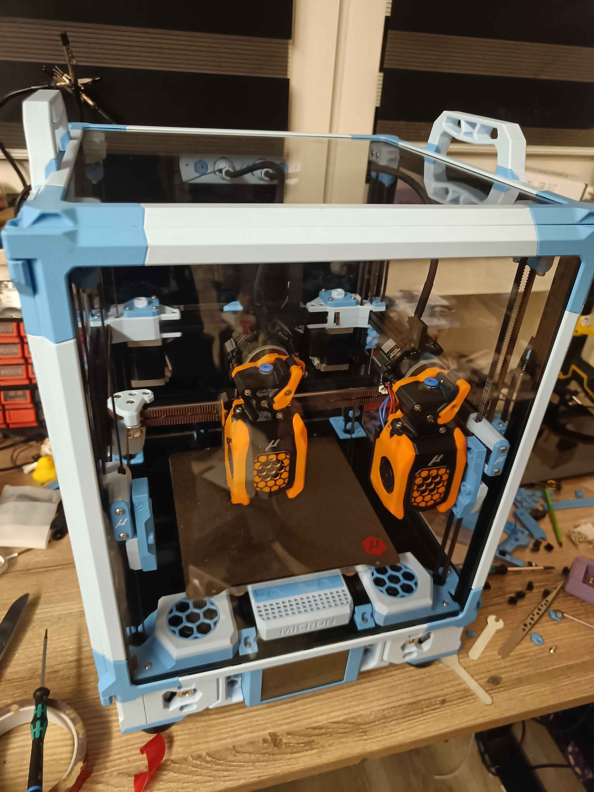

# Micronolith Panels

This is an adaptation of CabbageCorp's [Mini Monolith](../../CabbageCorp/Mini_Monolith/) for a Micron 180.

The vertical exists in two variants: Regular, for to-spec panels, and Formbot, whose panels are approximately 2mm taller than the cad vertically.

Side and top horizontals are provided to fit the Micron R1 handles. If you do not wish to use handles, print 4 more horizontals instead.

Please see Mini Monolith for the corner pieces, clips, and more detailed instructions.
